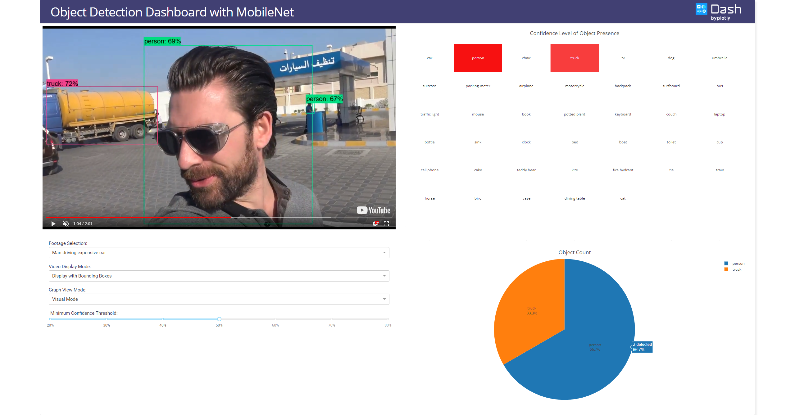

## Dash Object Detection Application

This is a demo of the Dash interactive Python framework developed by [Plotly](https://plot.ly/).

Dash abstracts away all of the technologies and protocols required to build an interactive web-based application and is a simple and effective way to bind a user interface around your Python code.

To learn more check out our [documentation](https://plot.ly/dash).

The custom video component is made by two Plotly community contributors. [You can find the source code here](https://github.com/SkyRatInd/Video-Engine-Dash).

All videos used are open-sourced under Creative Commons, except the James Bond scene. For this reason, we did not include a version with bounding boxes. The original links can be found in the video description.

### Model
The object detection model is the MobileNet v1, made by Google and trained on the COCO dataset. You can find their implementation in their [official Github](https://github.com/tensorflow/models/blob/master/research/slim/nets/mobilenet_v1.md). You are encouraged to try this app with other models.

### Bounding Box Generation
The data displayed in the app are pregenerated for demo purposes. To generate the csv files containing the objects detected for each frame, as well as the output video with bounding boxes, please refer to `utils/generate_video_data.py`. You will need the latest version of tensorflow and OpenCV, as well as the frozen graph `ssd_mobilenet_v1_coco`, that you can [download in the Model Zoo](https://github.com/tensorflow/models/blob/master/research/object_detection/g3doc/detection_model_zoo.md). Make sure to place the frozen graph inside the same folder as `generate_video_data.py`, i.e. `utils`.

### Screenshots
The following are screenshots for the app in this repo:

